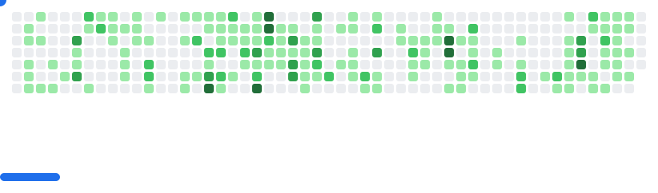

<h1>Hi, I'm Oleksii Shcherbak 👋</h1>

  Software Engineering Master's student at Woolf GoIT Neoversity and professional handball player from Ukraine, living in Finland. Combining the discipline of athletics with the precision of software development.

  Currently building my full-stack development skills, working with Python, modern web technologies, and data science tools.

<h3>🎯 Currently Learning</h3>

  
  
  
  
  

<h3>💻 Technologies & Tools</h3>

  
  
  
  
  
  
  
  
  
  

<h3>🌐 Connect With Me</h3>

  
  
  
  

 

  <picture>
    <source
      media="(prefers-color-scheme: dark)"
      srcset="images/breakout-dark.svg"
    />
    <source
      media="(prefers-color-scheme: light)"
      srcset="images/breakout-light.svg"
    />
    
  </picture>

