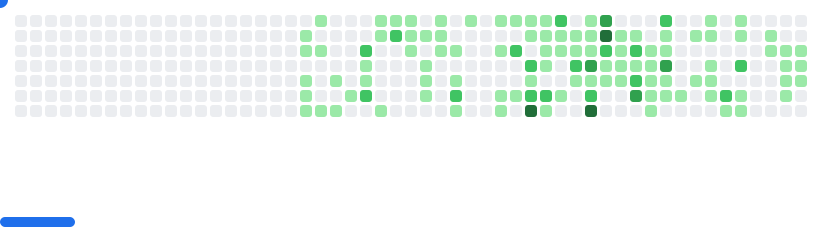

<h1>ℹ️About Me</h1>

  Hi, I'm Oleksii Shcherbak — a Software Engineering Master's student at Woolf GoIT Neoversity and a professional handball player.

I specialize in **Python development**, **software architecture**, and **data-driven engineering**. My background spans from building CLI tools and backend systems to working with real-world datasets for modeling and automation tasks.

Below is an overview of the technologies I work with, tools I use, and how you can connect with me or explore my work.

<!-- 👨‍💻 Programming & Markup Languages -->
<h3>👨‍💻 Programming & Markup Languages</h3>

  
  
  
  
  
  
  

<!-- 📊 Data Science Libraries -->
<h3>📊 Data Science Libraries</h3>

  
  
  
  
  
  
  
  
  

<!-- 💾 Databases & Query Tools -->
<h3>💾 Databases & Query Tools</h3>

  
  
  
  

<!-- 🧰 Tools & Platforms -->
<h3>🧰 Tools & Platforms</h3>

  
  
    
  
  
  
  
  <a href="https://www.figma.com/" target="_blank">
  
  
  

<!-- 📂 Communication & Organization -->
<h3>📂 Communication & Organization</h3>

  
  
  

<!-- 🌐 Online Profiles & Contact -->
<h3>🌐 Online Profiles & Contact</h3>

  
  
  
  

<!-- Snake contribution graph -->
<!-- 

-->

<!-- GitHub Breakout Animation -->

  <picture>
    <source
      media="(prefers-color-scheme: dark)"
      srcset="images/breakout-dark.svg"
    />
    <source
      media="(prefers-color-scheme: light)"
      srcset="images/breakout-light.svg"
    />
    
  </picture>

